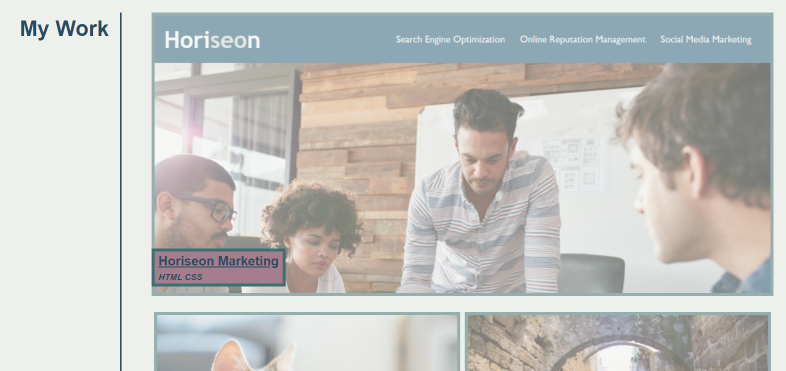
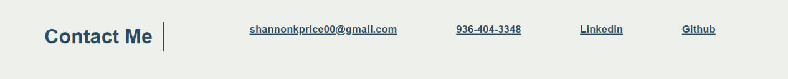

# Professional Portfolio

## Description

This webpage was made as a place to house all projects and showcase web development skills to potential employers. After completion of this project, there are three sections including an About Me section with a small biography, a My Work section with places for top projects to be exhibited, and a Contact Me sections with links for relavent contact information. 

## Installation

N/A

## Usage

To visit the webpage, click [here.](https://shannonkprice00.github.io/Professional-Portfolio-SKP/)

This webpage includes three sections for potential employers to explore. To jump to each section on the webpage, you can use the navigation bar (pictured below). Click on each link and the page will jump down to where there is more information. 

Alternatively, you can scroll down the page to find more informtion.

There are images in the My Work section which contain links to projects.

There are links provided in the Contact Me section.

## Credits

Tutorials followed:

* [CSS Layout](https://www.w3schools.com/Css/css_float.asp)
* [CSS Flex Responsive](https://www.w3schools.com/css/css3_flexbox_responsive.asp)
* [How To - Responsive Images](https://www.w3schools.com/howto/howto_css_image_responsive.asp)
* [How to Center an Image Vertically and Horizontally with CSS](https://www.freecodecamp.org/news/how-to-center-an-image-in-css/)
* [CSS Opacity/Transparency](https://www.w3schools.com/css/css_image_transparency.asp)

## License

MIT License
